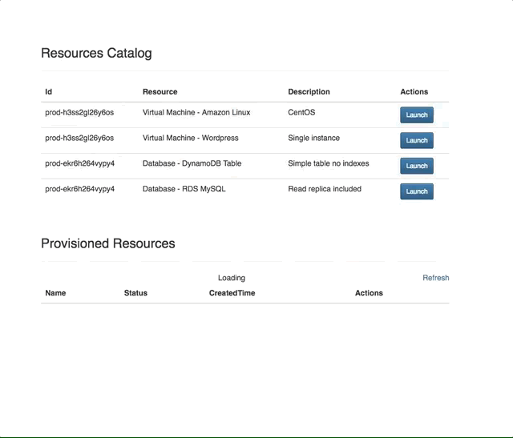
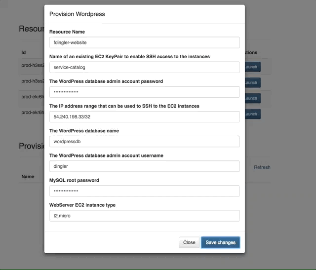
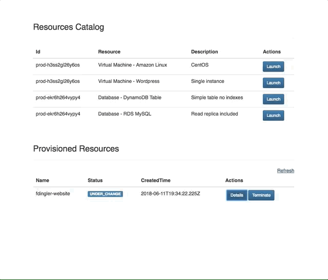

## AWS Service Catalog React Components

React components to display, provision and terminate products from an AWS Service Catalog.

## License Summary

This sample code is made available under a modified MIT license. See the LICENSE file.

## Why is this project useful?
Although Service Catalog provides a fully functional user interface for end-users already, this project is an alternative way of bringing Service Catalog into your own React website without giving your end-users access to the AWS Console. You can then customize and enhance this UI however you like.

## Installation

```
npm install --save aws-service-catalog-react-components
```

## Usage

The components require AWS credentials with permissions to interact with Service Catalog. We suggest to use
AWS Amplify with Cognito to provide credentials and a login screen for your users to authenticate.

```javascript
import { Auth } from 'aws-amplify';
import { withAuthenticator } from 'aws-amplify-react';
import {
  SCProducts,
  SCProvisionModal,
  SCProvisionedProducts,
  SCProvisionedDetailsModal,
} from "aws-service-catalog-react-components";

class App extends Component {
  componentDidMount() {
    Auth.currentCredentials().then(credentials => {
      this.setState({ credentials: Auth.essentialCredentials(credentials) });
    });
  }

  onLaunchClick() {
    console.log('User clicked Launch button');
  }

  render() {
    return() {
        <SCProducts
          credentials={this.state.credentials}
          onLaunchClick={this.onLaunchClick}
        />
    }
  }
}

export default withAuthenticator(App);
```

For more examples of usage please see the `demo` folder in this repository.

## Demo - Display Provision Parameters
Based on the cloudformation template parameters, the UI loads a form with them for the user to fill in.



## Demo - Provision a Product



## Demo - View Provisioned Product Details
Once a product is provisioned, you can check its CloudFormation output details.




